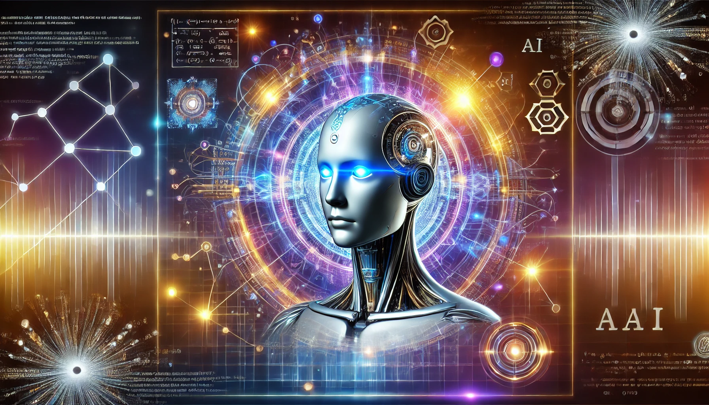

# Generative AI
Generative AI is a type of **Artificial Intelligence** technology that can produce various types of content including text, imagery, audio and synthetic data.

This repository contains concepts of all type of generative ai.

## Here are different kinds of Generative AI

- [Generative AI Text](./Gen%20AI%20Language/)
- [Generative AI Vision](./Gen%20AI%20Vision/)
- [Generative AI Audio](./Gen%20AI%20Audio/)
- [Generative AI MultiModal](./Gen%20AI%20MultiModal/)